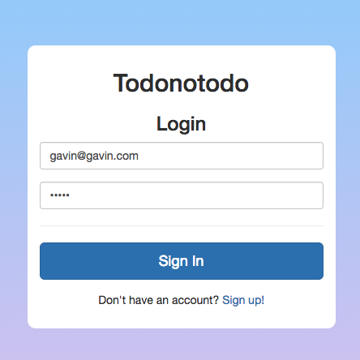
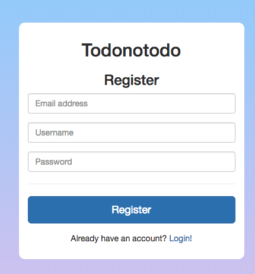
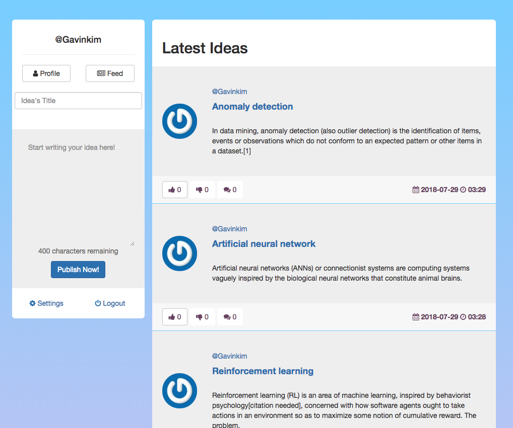
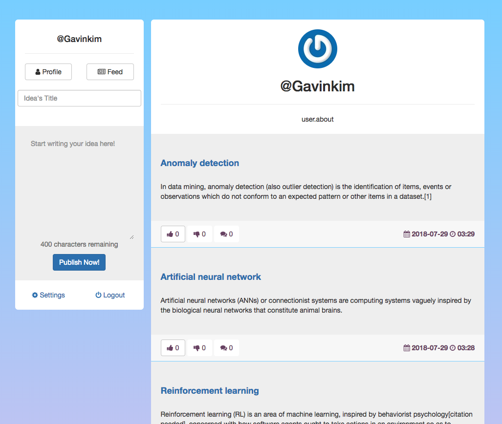
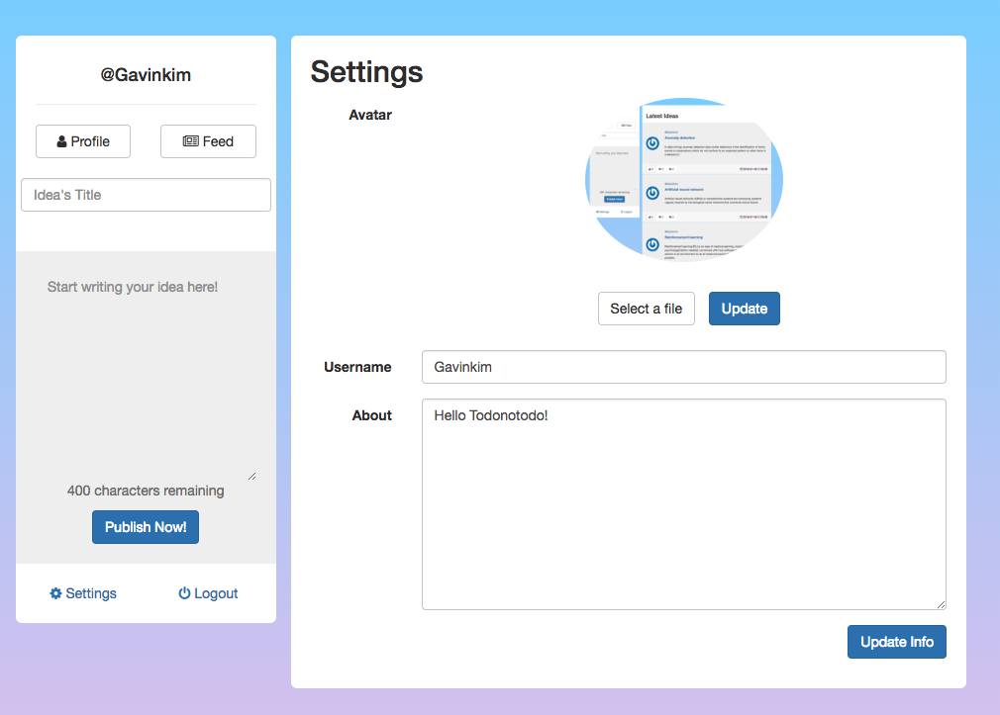

# todonotodo-web
 
### Usage
```sql
  - install dependencies
    npm install
  - serve with hot reload at localhost:8080
    npm run dev    
  - build for production with minification
    npm run build
  - build for production and view the bundle analyzer report
    npm run build --report  
```

### Relation Project Down below
> > [todonotodo-api](https://github.com/Gavinkim/todonotodo-api)

### Result

> Login
> > 

> Register
> > 

> Feed
> > 

> UserFeed
> > 

> User Info Settings
> > 
